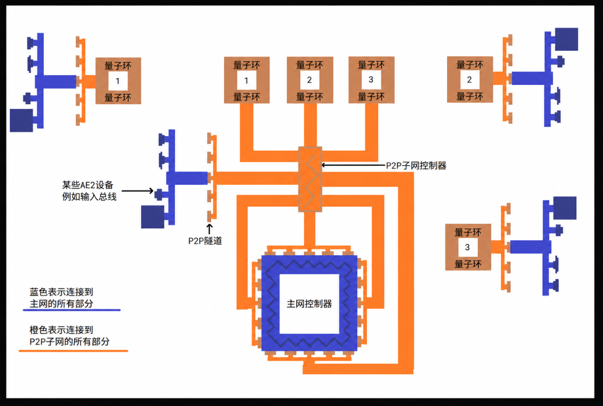

---
navigation:
  title: P2P通道
  parent: ae2-mechanics-index.md
---

# P2P通道

# 什么是P2P通道

P2P通道是一种在网络中传输物品、流体、红石信号、电力、光线和[频道](channel.md)等事物的方式，在GTNH中你还可以用它并发样板。P2P通道有许多变体，但每种变体只能传输特定类型的事物。P2P通道有明确的输入端与输出端，通道流通方向单向且不可反转。P2P通道支持多输出端但只支持单输入端（<ItemLink id="appliedenergistics2:item.ItemMultiPart:463" showIcon="Left"/>不一样，它虽然只支持但输入端，但是内部流体可以逆流）。

# <ItemLink id="appliedenergistics2:item.ItemMultiPart:460" showIcon="Left"/>

P2P通道-ME是传输AE频道的P2P通道，它可以让你将至多32个频道传输至所有输出端（所有输出端共用输入端的频道）。与其他P2P通道不同的是，P2P通道-ME本身需要在被传输的网络之外的AE网络上运行。

- P2P通道-ME简易用例

场景中黄色的无控制器小型AE独立网络将左侧控制器的32个频道传递至右侧，此时每个ME终端各使用一个频道。
<GameScene zoom="6" background="transparent">
  <ImportStructure src="../assets/p2p-me.snbt" />
  <IsometricCamera yaw="-60" pitch="30" />
</GameScene>

- P2P通道-ME规模化用例
  
  场景中黄色的拥有控制器的独立AE网络专职传输ME频道,P2P可以通过线缆传输也可以通过量子环传输。

<GameScene zoom="5" background="transparent">
  <ImportStructure src="../assets/compact-p2p-me.snbt" />
  <IsometricCamera yaw="-60" pitch="30" />
</GameScene>
  
- 下面是典型的使用P2P通道传输大量ME频道的网络架构。

  

## P2P通道的变体

<GameScene zoom="6" background="transparent">
  <ImportStructure src="../assets/p2p_tunnels.snbt" />
  <IsometricCamera yaw="180" pitch="0" />
</GameScene>

在原版AE2中，处于生存模式的玩家只能制作P2P通道-ME，通过手持特定物品右键P2P通道-ME可以将其转化为对应种类的P2P通道。使用<ItemLink id="appliedenergistics2:item.ToolMemoryCard" showIcon="Left"/>来连接P2P通道，Shift+右键绑定输入端，右键绑定输出端。GTNH中新增了两种新的P2P通道，它们可以通过工作台合成。
- P2P通道 - ME,使用任意[ME线缆](../items-blocks/cable.md)右键来转化。
- P2P通道 - 红石，使用任意红石元件右键来转化。
- P2P通道 - 物品，使用箱子或者桶右键来转化。
- P2P通道 - 流体，使用桶、水瓶或者任意<ItemImage id="EnderIO:itemLiquidConduit:0" label="right"/>来转化。
- P2P通道 - RF，使用任意<ItemImage id="EnderIO:itemPowerConduit:0" label="right"/>右键来转化。
- P2P通道 - 光，使用火把或者荧石右键来转化。
- P2P通道 - OC，使用<ItemImage id="OpenComputers:cable" label="right"/>右键来转化。
- P2P通道 - 声音，通过音符盒右键来转化。
- P2P通道 - GT EU，通过任意GT导线或GT线缆右键来转化。在GTNH的AE2中使用P2P通道 - GT EU时会受到电压惩罚，从P2P通道 - GT EU输出端输出的电能每安电流需要交5%的电压税，例如输入端输入8192V 16A，则对应的输出端输出7782V 16A。
- P2P通道 - ME接口， <RecipesFor id="appliedenergistics2:item.ItemMultiPart:471" />
- P2P通道 - ME二合一接口， <RecipesFor id="ae2fc:part_fluid_p2p_interface" />

